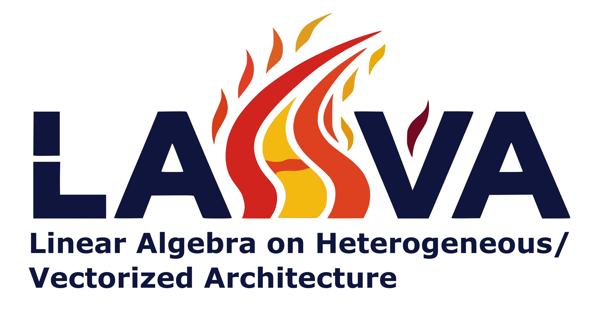
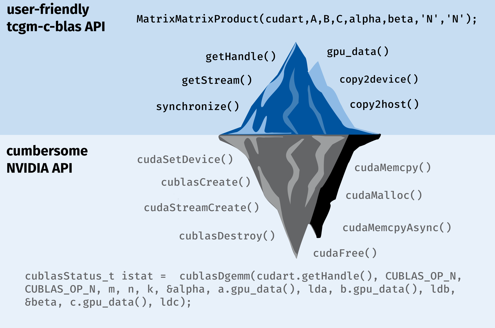

# LAHVA - Linear Algebra on Heterogenous/Vectorized Architecture

## Motivation & Purpose

The motivation behind the LAHVA project is to create a commodity layer that enables faster and more user-friendly interaction with heterogeneous computing hardware. The API of BLAS and LAPACK libraries are usually cumbersome especially when moving to accelerator hardware such as GPUs. Due to the complexity of the hardware and the communication between host and device (the accelerator) more objects are needed to control the execution of linear algebra operations. We want to come in and simplify the API by bundling the additional objects needed for the execution in a runtime. Additionally, we have implemented Tensor classes for Vector, Matrix and Lower triangular matrix. Due to the fact that memory spaces of the host and device are usually separate, we also need to take care of the transfer of information and addressing the right memory space in functions. Therefore, we went for a solution where a Tensor object can have to pointers, a host and device pointer. Allocators can then be used for both to allocate the memory. For GPU allocators we also implement the transfer within the allocator object.
The project is heavily focussed on using template variables for numeric precision as well as execution of the function on either host or device merely by changing the used Runtime. 

The iceberg symbolizes graphically the motivation of this project to simplify the interface between LAHVA and a vendor BLAS library such as nvidia's cuBLAS.



## Compatibility 

We test the implementation for a permutation of the following operating systems, compilers and BLAS/LAPACK implementations with and without GPU support:

| Operating System | Compiler | CPU BLAS/LAPACK | CUDA |
|------------------|----------|-----------------|------|
| Ubuntu 20.04 | intel oneAPI 2023.2.0 | intel oneMKL 2023.2.0 | 11.8 |
| | gcc-9 | OpenBLAS |  |

Build system: meson (v. 1.4.0), cmake (> 3.18)
Build generator: ninja, make

We also provide apptainer recipes to use for building and deployment purposes. You can find them in the subfolder `apptainer_recipe`.

## Compile from source

Currently, we support both [meson](https://mesonbuild.com/) and CMake build system.  

### Meson build

First of all, LAHVA can be compiled with and without GPU support (default is with GPU support, nvidia only).  
This behavior is set by `-Dgpu=true` or within the `meson_options.txt` file.

#### GPU build

If you are planning to use an nvidia GPU, you will need the compute capability of your GPU or the range of GPUs that the software should be deployed to. One resource to find out this value is [techpowerup](https://www.techpowerup.com/). You can search for your hardware and find the compute capability (cc) under Graphics Features then CUDA. The cc value is given with a `.` between both digits. However, when changing the value of `gpu_arch` in `meson_options.txt` remove the `.` and fill in the cc values of all cards that will be used with the program in the array.

Next you should take care that `meson` is able to find your CUDA installation. The easiest way to take care of this is to set the `CUDA_ROOT` environment variable used by `meson`. It should point to the root of your CUDA installation path, i.e. `/mnt/group-lib/nvidia-hpc-sdk/Linux_x86_64/24.7/cuda/11.8/`. When you are using a non-standard installation path for CUDA if you are on a shared HPC or other system, it can be necessary to also set the paths for `libcudart` the CUDA runtime library and other libraries such as `libcublas` or `libcusolver`. YOu can achieve this by setting or extending the `LIBRARY_PATH` environment variable. For example: `export LIBRARY_PATH=/mnt/group-lib/nvidia-hpc-sdk/Linux_x86_64/24.7/cuda/11.8/lib64:$LIBRARY_PATH`. Finally, if you have several `nvcc` versions installed it might be helpful to set the path of `nvcc` also explicitly.
Now that the compile environment is setup for GPU compilation, we need to setup the meson build. Optional arguments are: the lapack vendor (options: `mkl`, `openblas`; default: `auto`)


``` bash
meson setup _build -Dgpu=true [optional: -Dlapack=mkl,openblas]
```

After the setup, we can compile LAHVA like so:

``` bash
meson compile -C _build 
```

Lastly, we can test the library using the provided unit tests.

``` bash
meson test -C _build 
```

#### Use as subproject in other projects

One of the more common applications is to use LAHVA as a subproject in other projects to reuse the implemented tensor classes and its BLAS interface.

Using `meson` this is rather straightforward, the following dependency should be added to the `meson.build` file.

```python
lahva_dep = dependency(
  'lahva',
  version: '>=0.0.0',
  fallback: ['lahva', 'lahva_dep'],
  default_options: ['default_library=static'],
)
```

## Usage

LAHVA provides an implementation for 3 kinds of Tensor Classes:
- Vector (1D-Tensor)
- Matrix (2D-Tensor)
- Lower Triangular Matrix [LowTriMatrix] (symmetric 2D Tensor, in packed mode)

In accordance with the purpose of this library, these classes are available in a CPU-only and in a GPU and CPU version. Similar to the std-library containers they are available for various numerical precisions (i.e. `int`, `double`, `float`) via template parameters. Additionally, similar to `std::vector` allocators are used to allocate and deallocate memory for the containers. However, this template parameter is optional.

In general, there are two ways to use the provided Tensor classes:
a) in a static fashion, i.e. import one namespace and use it in that way. This works best outside of classes.


### Setup Tensor classes


## Support

Please open an issue in this GitLab repo, so we can help you out.

## Roadmap
If you have ideas for releases in the future, it is a good idea to list them in the README.

## Authors and acknowledgment

Original author: Pit Steinbach  
with contributions from: Mark Heezen  
under the supervision of: Christoph Bannwarth

## License
For open source projects, say how it is licensed.

## Project status

This project is still in an experimental state, though we are committed to keep the API stable, changes could occur.
